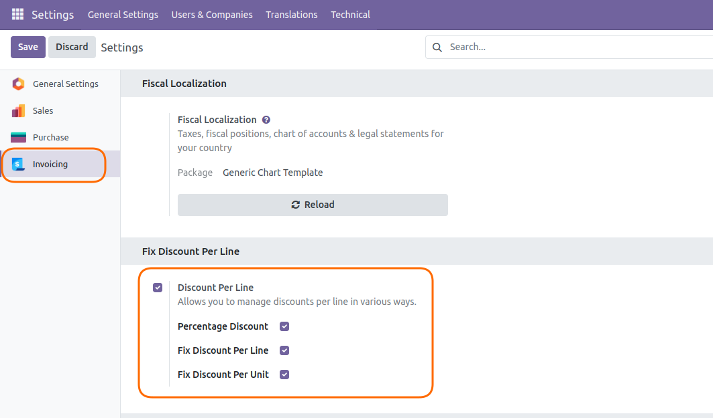
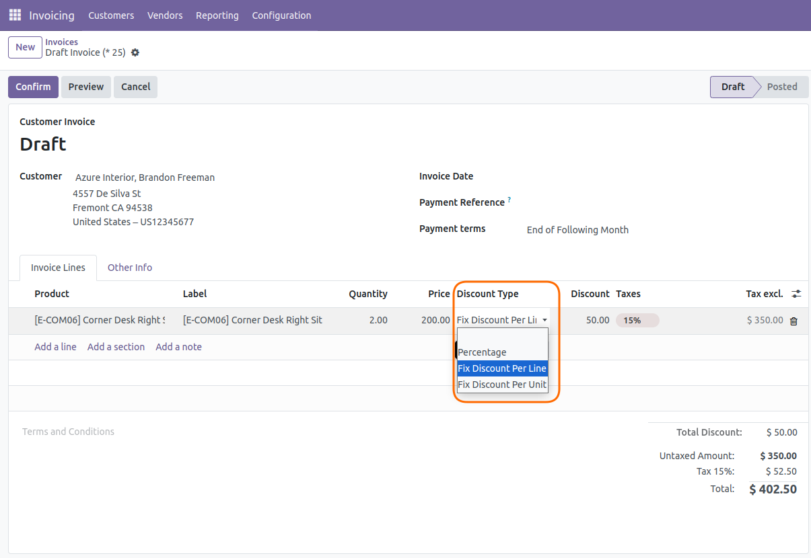
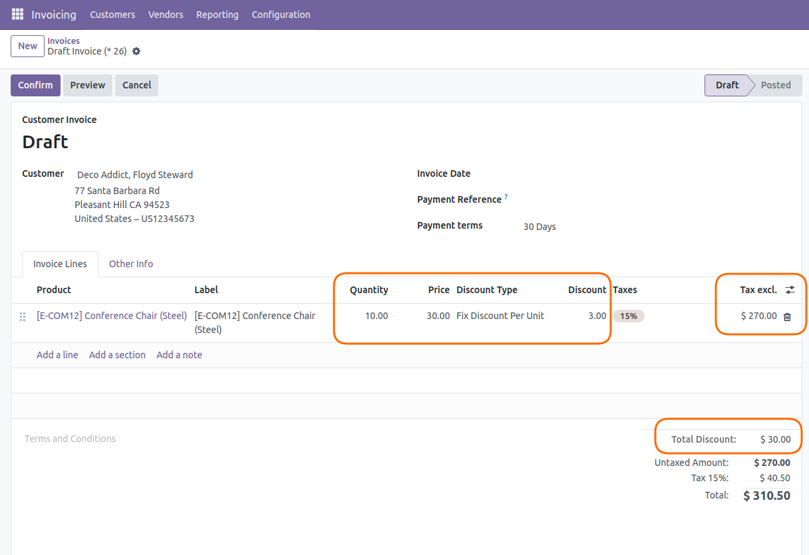
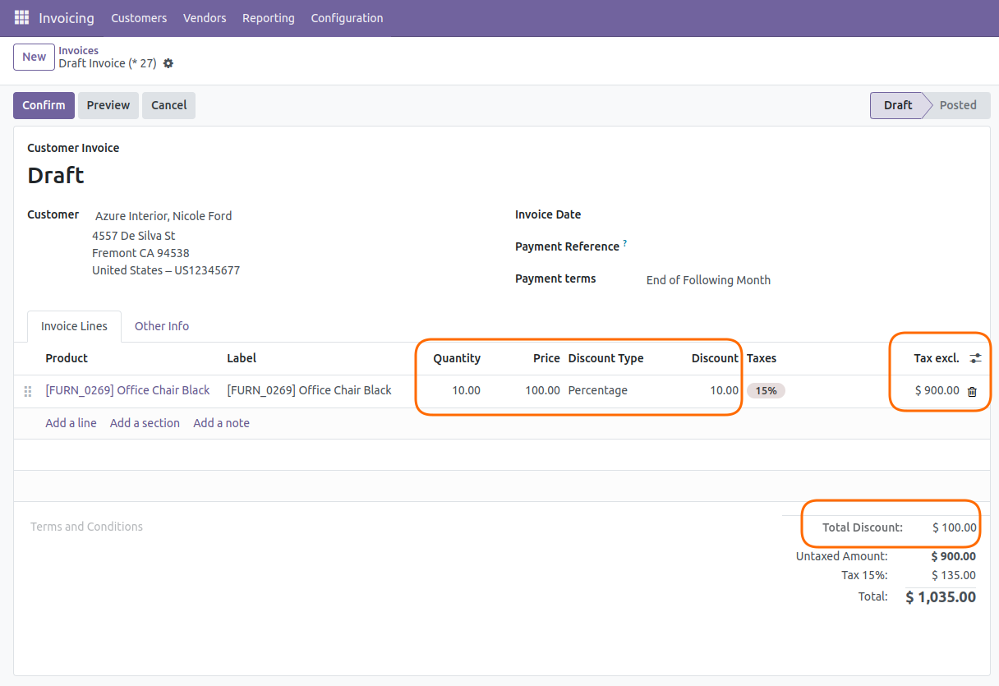
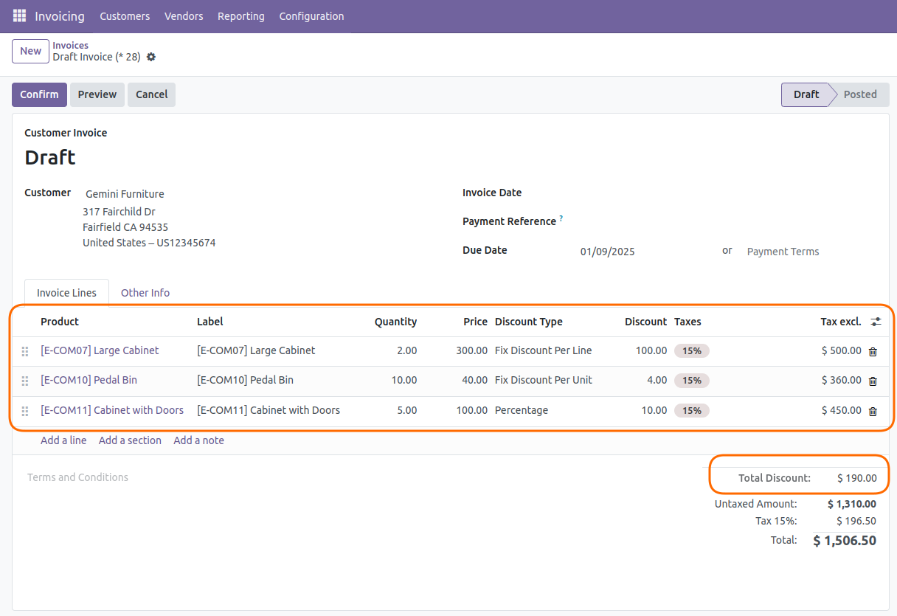
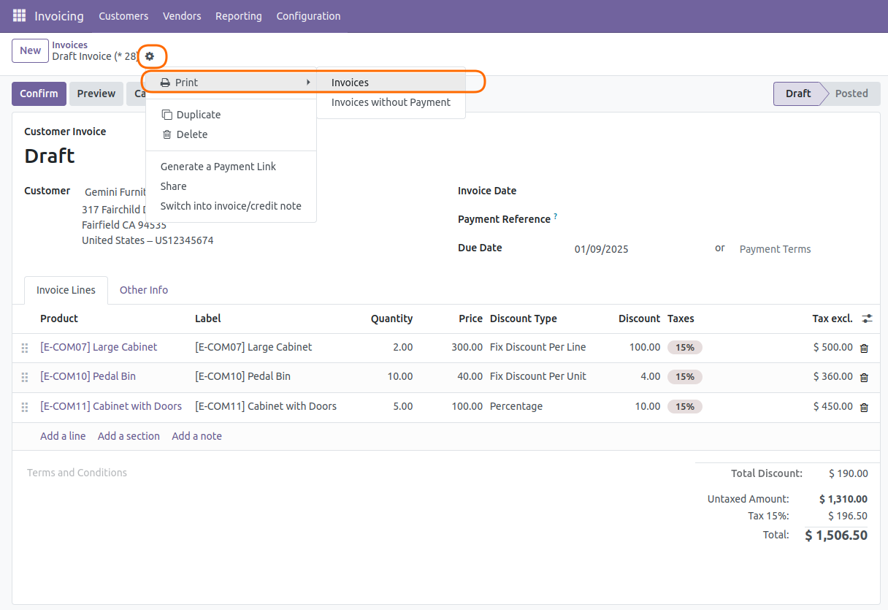
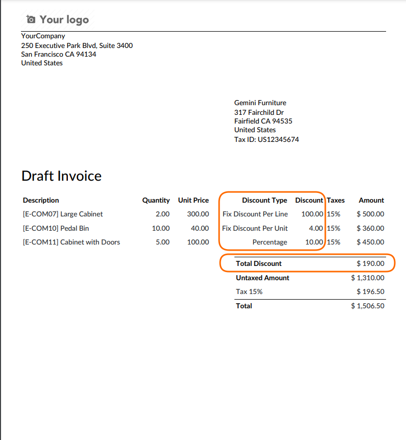
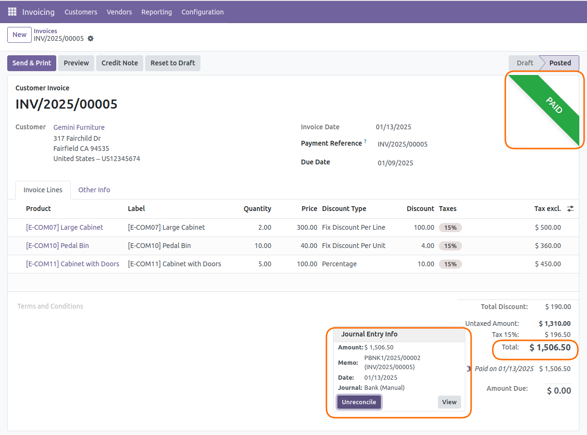

# Invoice Discount Per Line

## Overview

The **Invoice Discount Per Line** module enhances Odoo's discount management capabilities by allowing you to apply flexible, line-specific discounts on invoices. This module provides businesses with advanced discounting options to meet diverse pricing strategies, ensuring better control over invoicing and customer satisfaction.

## Configuration

## Features

### 1. Fix Discount Per Line
Apply a fixed discount amount to an invoice line. This feature allows you to reduce the total amount of a specific line by a set monetary value, regardless of the quantity or unit price of the product.

### 2. Fix Discount Per Quantity
Define a fixed discount amount for each unit of a product in an invoice line. This feature ensures that the discount increases proportionally with the quantity of the product

### 3. Percentage Discount Per Line
Apply a discount as a percentage of the total amount for an invoice line. This option is ideal for dynamic pricing strategies where the discount scales with the line total.

## Discount Options

## Fix Discount Per Line

## Fix Discount Per Quantity

## Percentage Discount Per Line

## All Discount Options Together

## PDF Report

## Register Payment On Invoice

